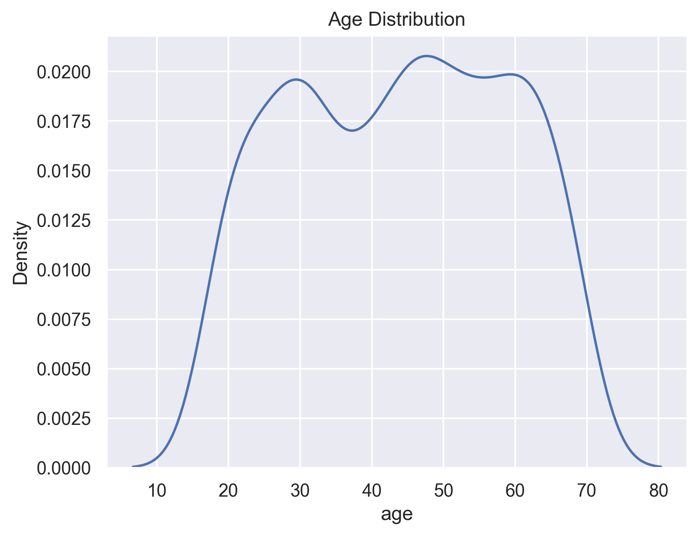
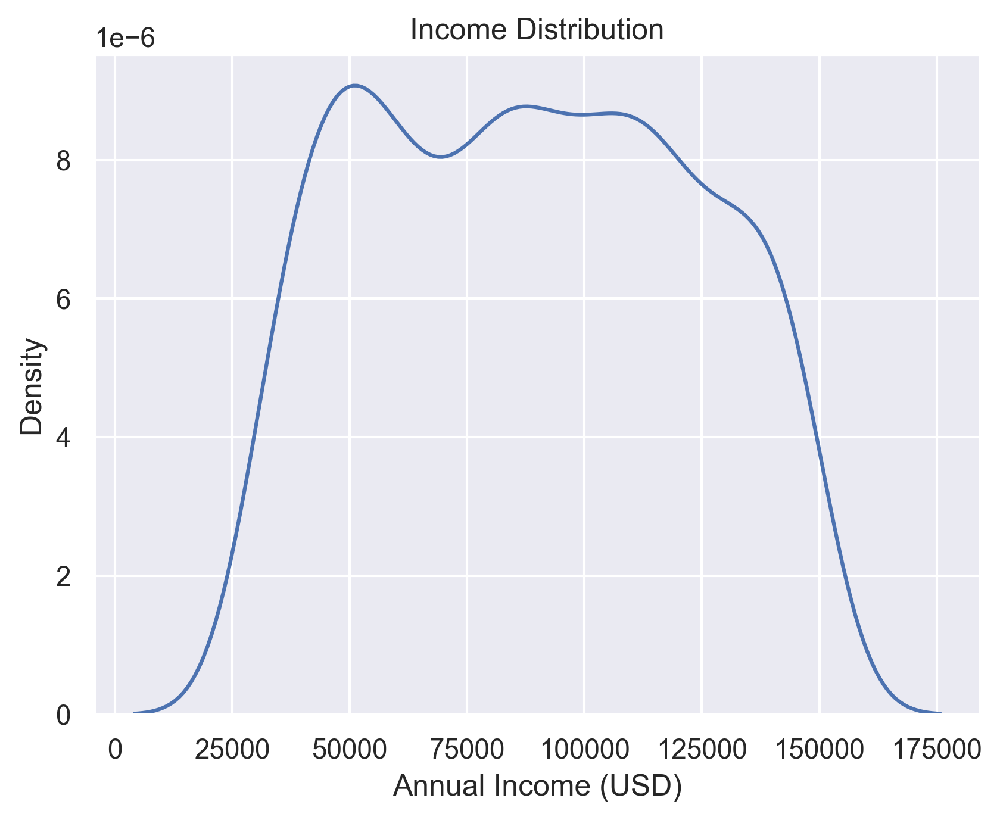
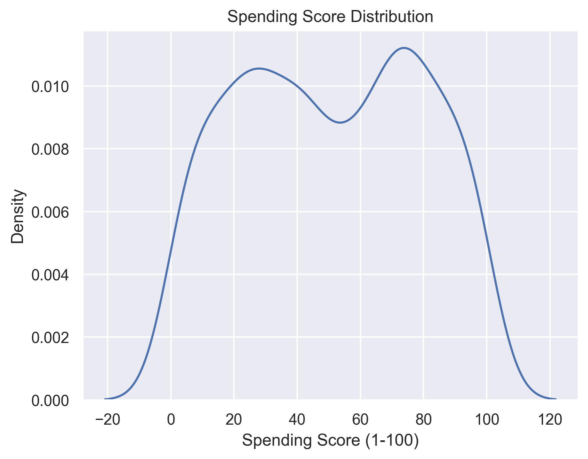
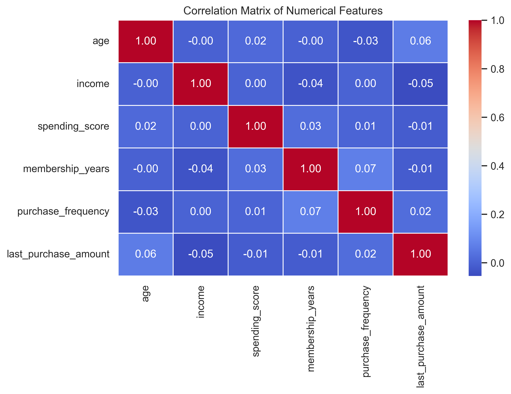
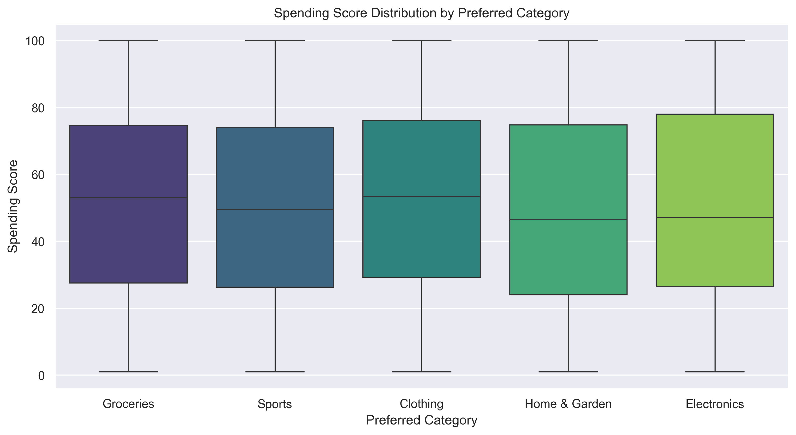
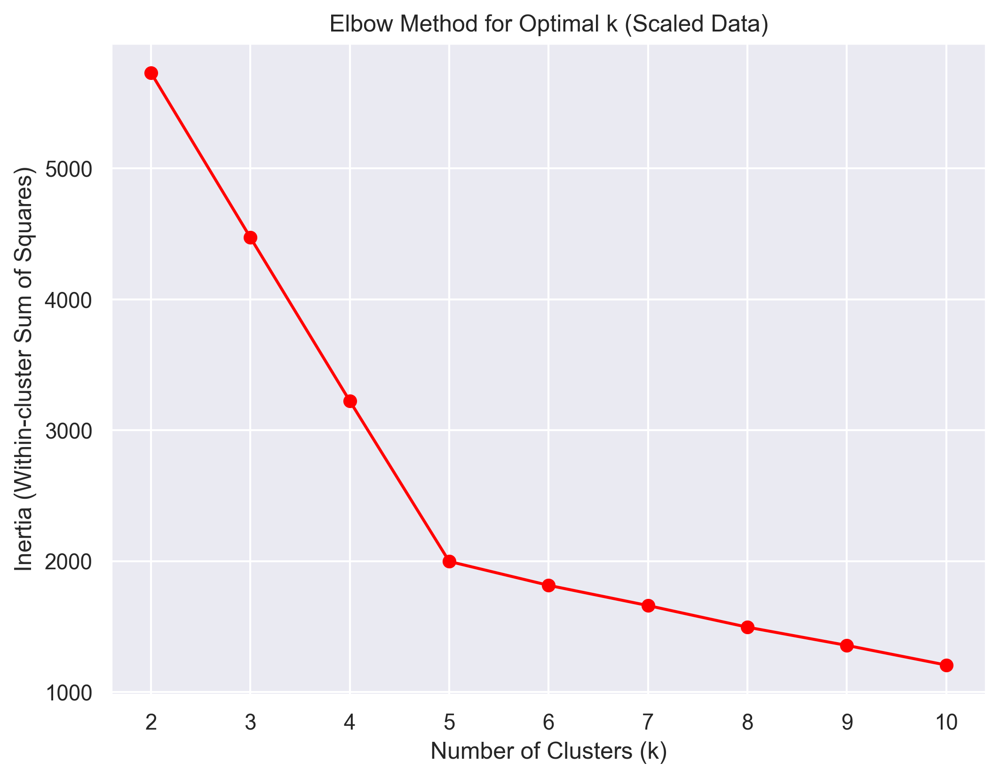
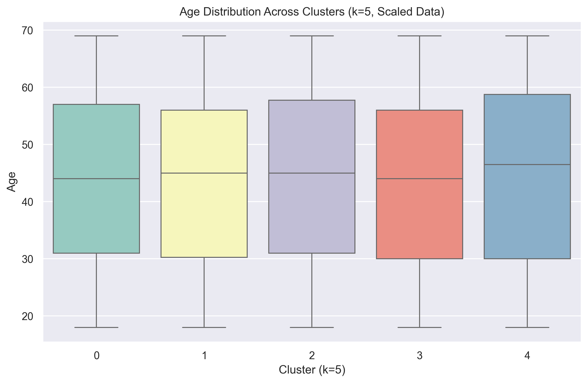
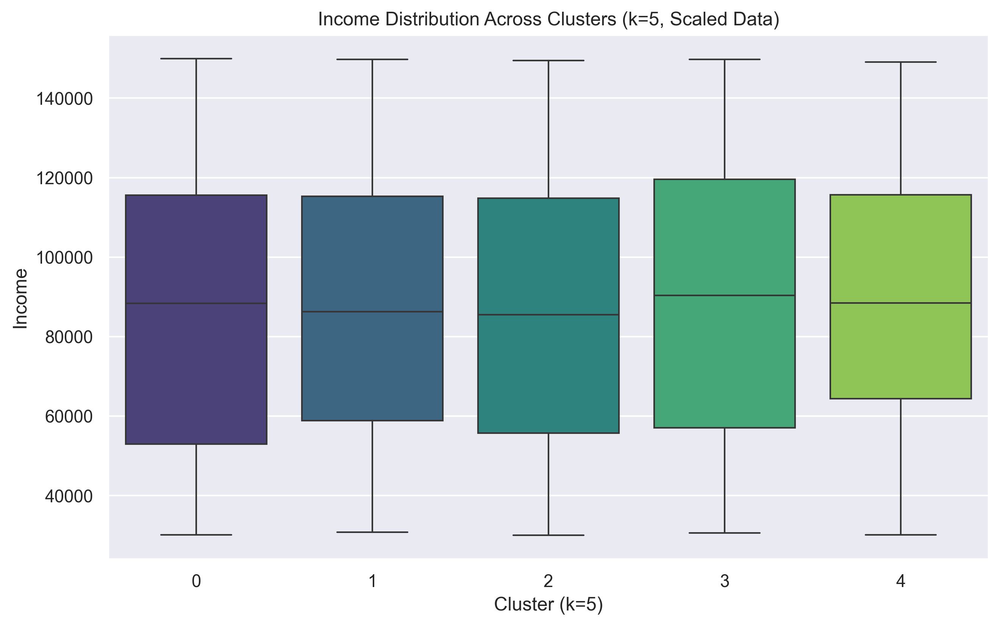
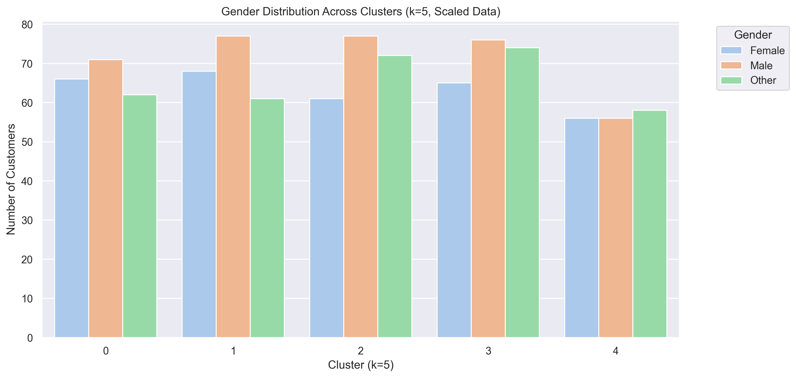

# Customer Segmentation for Enhanced Marketing Strategies

A machine learning project using K-Means clustering to segment customers into distinct groups for targeted marketing strategies.

---

## Table of Contents

- [Project Overview](#project-overview)
- [Key Skills Applied](#key-skills-applied)
- [Results & Visualizations](#results--visualizations)
- [Customer Segments Identified](#customer-segments-identified)
- [Technologies Used](#technologies-used)
- [Installation](#installation)
- [Usage](#usage)
- [Project Structure](#project-structure)
- [Business Value](#business-value)

---

## Project Overview

This project employed K-Means clustering to segment a customer base into distinct groups for a more targeted and effective marketing approach. By analyzing customer spending behavior, purchase frequency, and preferred product categories, we identified **five unique customer segments**, each with distinct characteristics and actionable business implications.

The analysis focuses on behavioral and demographic features to create meaningful customer profiles that enable data-driven marketing decisions.

---

## Key Skills Applied

- **Data Analysis & EDA**: Exploratory Data Analysis to understand customer behavior patterns
- **Machine Learning (K-Means Clustering)**: Unsupervised learning for customer segmentation
- **Feature Engineering & Scaling**: Data preprocessing including one-hot encoding and standardization for optimal model performance
- **Cluster Evaluation & Interpretation**: Using multiple metrics (Silhouette Score, Calinski-Harabasz Score, Davies-Bouldin Score) and visualizations to validate cluster quality
- **Business Insights & Actionability**: Translating data-driven segments into practical marketing strategies
- **Python Programming**: Leveraging Pandas, Scikit-learn, Seaborn, and Matplotlib for end-to-end analysis

---

## Results & Visualizations

### Exploratory Data Analysis

The analysis began with comprehensive exploration of customer features including age, income, spending score, purchase frequency, and product preferences.


*Customer age distribution showing a broad demographic range with concentration in middle-age groups*


*Annual income distribution reveals diverse economic segments from budget-conscious to affluent customers*


*Spending score patterns indicate varied customer value and engagement levels*


*Feature correlation analysis identifying key relationships between customer attributes*


*Average spending patterns across product categories reveal distinct purchasing behaviors*

### Model Selection & Evaluation

The Elbow Method and multiple cluster evaluation metrics were used to determine the optimal number of clusters (k=5).


*Elbow curve analysis showing k=5 as the optimal cluster count balancing granularity and model performance*


*Comprehensive cluster quality validation using Silhouette, Calinski-Harabasz, and Davies-Bouldin scores*

### Cluster Analysis

The final model identified five distinct customer segments with unique behavioral and demographic characteristics.


*Age distribution across segments reveals distinct generational targeting opportunities*


*Income stratification by cluster enabling precise economic segmentation strategies*


*Gender composition analysis showing varying demographic profiles across customer segments*

---

## Customer Segments Identified

### Segment 0: Female-Dominant Affluent Grocery Shoppers
- **Characteristics**: Medium-high spending score and purchase frequency, primarily focused on groceries
- **Demographics**: Mid-to-higher median income ($85-90k), predominantly female
- **Marketing Strategy**: Implement grocery loyalty programs and targeted promotions for high-value grocery items

### Segment 1: Female-Leaning Electronics & Outdoor Enthusiasts
- **Characteristics**: Moderate spending and purchase frequency, interested in electronics, home & garden, and sports
- **Demographics**: Mid-range median income ($80-85k), female majority
- **Marketing Strategy**: Targeted electronics and outdoor gear marketing campaigns tailored to this demographic

### Segment 2: Female-Leaning Home & Garden Specialists
- **Characteristics**: Lower spending score and purchase frequency, focused on home & garden products
- **Demographics**: Lowest median income ($70-75k), predominantly female, budget-conscious
- **Marketing Strategy**: Value-focused promotions and budget-friendly offers for home improvement products

### Segment 3: Gender-Balanced Fashion/Tech/Sports Shoppers
- **Characteristics**: Highest spending score with moderate purchase frequency, balanced interest across clothing, electronics, and sports
- **Demographics**: Highest median income ($105-115k), more gender-balanced distribution
- **Marketing Strategy**: Aspirational, trend-focused marketing for premium fashion, technology, and sports products

### Segment 4: Female-Dominant Dedicated Fashionistas
- **Characteristics**: Moderate spending score with highest purchase frequency, intensely focused on clothing
- **Demographics**: Higher median income ($90-95k), very strong female majority
- **Marketing Strategy**: Trend-focused fashion campaigns with exclusive offers and early access to new collections

---

## Technologies Used

| Category | Tools |
|----------|-------|
| **Programming Language** | Python 3.8+ |
| **Data Manipulation** | Pandas, NumPy |
| **Machine Learning** | Scikit-learn (KMeans, StandardScaler, OneHotEncoder) |
| **Data Visualization** | Matplotlib, Seaborn |
| **Development Environment** | Jupyter Notebook |

---

## Installation

### Prerequisites

- Python 3.8 or higher
- pip package manager

### Setup Instructions

1. **Clone or download this repository**

2. **Navigate to the project directory**
   ```bash
   cd customer-segmentation-ml-kmeans
   ```

3. **Create a virtual environment** (recommended)
   ```bash
   python -m venv venv
   ```

4. **Activate the virtual environment**

   On Windows:
   ```bash
   venv\Scripts\activate
   ```

   On macOS/Linux:
   ```bash
   source venv/bin/activate
   ```

5. **Upgrade pip** (recommended)
   ```bash
   python -m pip install --upgrade pip
   ```

6. **Install required dependencies**
   ```bash
   pip install -r requirements.txt
   ```

7. **Install Jupyter kernel** (Critical for VS Code/Jupyter integration)
   ```bash
   python -m ipykernel install --user --name=venv --display-name "Python (venv)"
   ```

   This step registers your virtual environment as a Jupyter kernel, allowing VS Code and Jupyter to recognize and use the correct Python environment with all installed dependencies.

---

## Usage

### Option A: Using Jupyter Notebook in Browser

1. **Activate your virtual environment**

   On Windows:
   ```bash
   venv\Scripts\activate
   ```

   On macOS/Linux:
   ```bash
   source venv/bin/activate
   ```

2. **Launch Jupyter Notebook**
   ```bash
   jupyter notebook
   ```

3. **Open and run the notebook**
   - In the Jupyter interface that opens in your browser, click on `Customer Segmentation Project.ipynb`
   - Execute cells sequentially using `Shift + Enter`
   - Or run all cells: `Cell` > `Run All`

4. **Review the results**
   - Visualizations will be displayed inline and automatically saved to the `imgs/` directory
   - Examine the exploratory data analysis, cluster evaluation metrics, and customer segments

### Option B: Using VS Code (Recommended for VS Code users)

1. **Activate your virtual environment**

   On Windows:
   ```bash
   venv\Scripts\activate
   ```

   On macOS/Linux:
   ```bash
   source venv/bin/activate
   ```

2. **Ensure Jupyter kernel is installed** (if not already done in installation)
   ```bash
   python -m ipykernel install --user --name=venv --display-name "Python (venv)"
   ```

3. **Open the project in VS Code**
   - Open the project folder in VS Code
   - Open `Customer Segmentation Project.ipynb`

4. **Select the correct kernel**
   - Click "Select Kernel" in the top-right corner of the notebook
   - Choose "Python (venv)" from the kernel list
   - If the kernel doesn't appear, restart VS Code window: `Ctrl+Shift+P` > "Developer: Reload Window"

5. **Run the analysis**
   - Click "Run All" button at the top of the notebook
   - Or run cells individually with `Ctrl+Enter` or `Shift+Enter`
   - Visualizations will be displayed inline and automatically saved to the `imgs/` directory

6. **Review the results**
   - Examine the exploratory data analysis, cluster evaluation metrics, and customer segments

---

## Project Structure

```
customer-segmentation-ml-kmeans/
├── Customer Segmentation Project.ipynb    # Main analysis notebook
├── customer_segmentation_data.csv         # Customer dataset
├── requirements.txt                       # Python dependencies
├── .gitignore                            # Git exclusion patterns
├── README.md                             # Project documentation
└── imgs/                                 # Generated visualizations
    ├── 01_age_distribution.png
    ├── 02_income_distribution.png
    ├── 03_spending_score_distribution.png
    ├── 09_correlation_matrix.png
    ├── 14_elbow_curve.png
    ├── 15_cluster_metrics_comparison.png
    ├── 16_age_by_cluster.png
    ├── 17_income_by_cluster.png
    ├── 18_gender_by_cluster.png
    └── ... (additional visualizations)
```

---

## Business Value

This segmentation provides a powerful framework for:

- **Personalized Marketing**: Tailoring marketing campaigns and messaging to resonate with each segment's specific needs, preferences, and purchasing behaviors

- **Optimized Resource Allocation**: Focusing marketing efforts, budget, and resources on the most relevant and profitable customer groups to maximize ROI

- **Enhanced Customer Engagement**: Creating more relevant and personalized customer experiences, leading to increased customer satisfaction, loyalty, and lifetime value

- **Strategic Decision-Making**: Enabling data-driven decisions for product development, inventory management, and channel strategy based on segment-specific insights

- **Revenue Growth**: Targeting high-value segments with premium offerings while maintaining value propositions for price-sensitive groups

---

This project demonstrates the ability to leverage data analysis and machine learning to derive actionable customer insights, enabling businesses to create more effective and customer-centric strategies.
